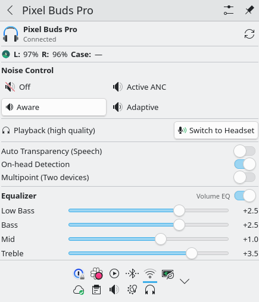
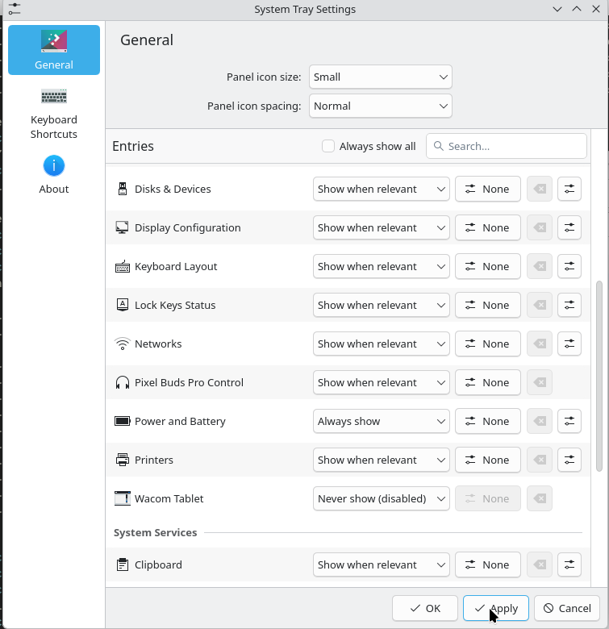

# pbpctrl-plasmoid

A KDE Plasma 6 system tray plasmoid for controlling [Google Pixel Buds Pro](https://github.com/qzed/pbpctrl) on Linux.



## Features

- **ANC mode** — Off / Active / Aware / Adaptive
- **Battery status** — left bud, right bud, case
- **Audio profile toggle** — switch between High Fidelity Playback (A2DP) and Headset (HSP/HFP) without opening audio settings
- **5-band EQ** — low bass, bass, mid, treble, upper treble (-6.0 to +6.0 dB)
- **Volume-dependent EQ** toggle
- **Auto-transparency** (speech detection) toggle
- **On-head detection** toggle
- **Multipoint audio** toggle (simultaneous two-device connection)
- **Auto-hides** from system tray when buds are not connected

## Requirements

- KDE Plasma 6 with `plasma5support`
- [`pbpctrl`](https://github.com/qzed/pbpctrl) installed and in `$PATH` (available on the [AUR](https://aur.archlinux.org/packages/pbpctrl))
- `pactl` (provided by `libpulse`, for audio profile switching)

### Optional — extra Bluetooth codecs

Install these to unlock additional audio profiles (Opus, LC3-SWB, aptX, LDAC):

```sh
paru -S libfdk-aac liblc3 libfreeaptx libldac opus
```

## Installation

### AUR (Arch Linux)

```sh
paru -S pbpctrl-plasmoid
```

Or for the latest git version:

```sh
paru -S pbpctrl-plasmoid-git
```

### From source (Arch Linux)

```sh
git clone https://github.com/ciarancoffey/pbpctrl-plasmoid.git
cd pbpctrl-plasmoid
makepkg -si
```

### Manual (any distro)

```sh
git clone https://github.com/ciarancoffey/pbpctrl-plasmoid.git
cd pbpctrl-plasmoid
kpackagetool6 --type Plasma/Applet --install plasmoid
```

To update an existing manual installation:

```sh
kpackagetool6 --type Plasma/Applet --upgrade plasmoid
```

## Post-install

After installing, restart Plasma to load the new widget:

```sh
plasmashell --replace &
```

> **Note:** A plasmashell restart is required whenever a plasmoid is installed or updated system-wide. This is a Plasma limitation — it does not hot-reload from `/usr/share/plasma/plasmoids/`.

The widget will then appear automatically in the **Status and Notifications** section of the system tray when your Pixel Buds Pro are connected. It auto-hides when they are not.

If it doesn't appear, right-click the system tray → **Configure System Tray** → **Extra Items** and enable **Pixel Buds Pro Control**:



## Usage

Click the headphone icon in the system tray to open the control panel. Use the refresh button (↻) to force an immediate sync if the state looks stale.

The plasmoid polls device state every 10 seconds.

## License

MIT
